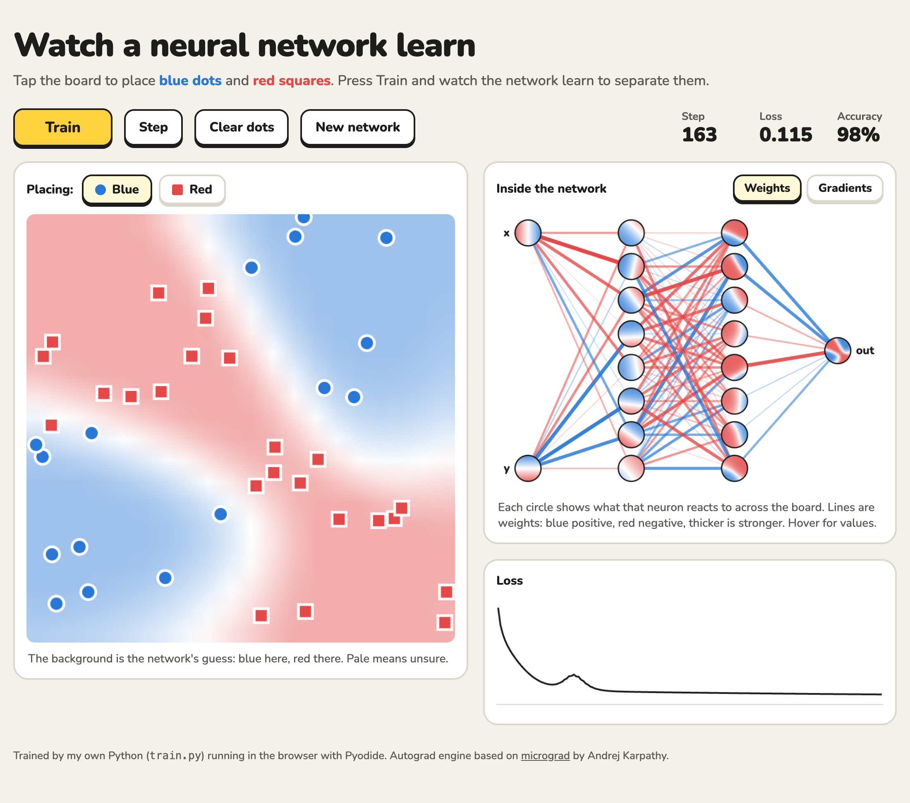
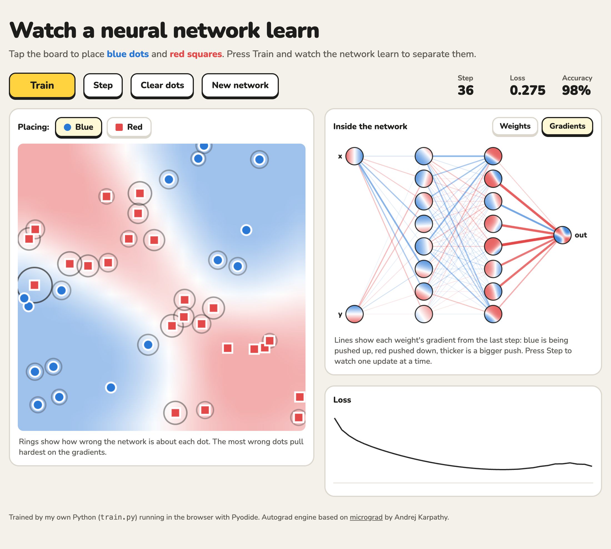

# Watch a Neural Network Learn

**[▶ Try it live](https://kenneth13he.github.io/Neural-Network-Visualizer/)**

An interactive page where you place blue and red dots, press **Train**, and watch a neural network learn to separate them. You see its decision boundary, what each neuron has learned, and the gradients that move every weight.

The network runs on a **from-scratch autograd engine written in Python**. No PyTorch or TensorFlow is involved: every gradient comes from a small `Value` class, and the Python runs right in your browser with [Pyodide](https://pyodide.org).



## What you can do

- **Draw your own data.** Tap the board to place dots, switching between blue and red with the **Placing** toggle. Add dots mid-training and watch the network adapt.
- **Watch it learn.** The background shows the network's guess at every spot on the board, and pale areas are where it's unsure.
- **Look inside the network.** Each neuron shows a tiny map of what it reacts to. First-layer neurons learn straight cuts; the second layer combines them into curves and corners.
- **See backpropagation happen.** Switch the network view to **Gradients** to see which way each weight is being pushed, and press **Step** to run one update at a time. Rings on the board show how wrong the network is about each dot: the most wrong dots pull hardest.



## How it works

Every training step does four things, all in Python (`train.py`):

1. **Forward:** run every dot through the network to get a prediction.
2. **Loss:** measure how wrong it is: the average of `(prediction - label)²`.
3. **Backward:** call `loss.backward()`, which uses the chain rule to give every weight a gradient.
4. **Update:** nudge every weight against its gradient: `w -= learning_rate × gradient`.

The learning rate starts at 0.2 and shrinks over time, so the boundary settles instead of wiggling. Drawing the background uses `predict_fast`, a plain-number forward pass that skips building the autograd graph. That makes it about 30× faster, since drawing doesn't need gradients.

## How this differs from TensorFlow Playground

Google's [TensorFlow Playground](https://playground.tensorflow.org) is a well-known site with a similar look. This project is different in two ways:

- **The engine is built from scratch.** The autograd engine (`back_propagation.py`) and the training loop are small enough to read in a few minutes.
- **It shows backpropagation itself**, not just its results: per-weight gradients, per-dot error, and single-step updates.

## Files

| File | What it does |
|---|---|
| `back_propagation.py` | `Value`: a number that remembers how it was made and computes its own gradient with `.backward()` |
| `neural_network.py` | `Neuron`, `Layer` and `MLP`: a neural network built out of `Value`s |
| `train.py` | Datasets, the training step, fast prediction, and helpers that read weights, gradients and activations for the page |
| `index.html` | The interactive page. It loads the three Python files above and draws everything |
| `nudge.py` | An experiment showing that a gradient really predicts how the output changes when an input is nudged |
| `draw_dot.py` | Draws a computation graph with Graphviz (for the command line) |

## Run it locally

The page has to be served over HTTP, because opening the file directly blocks it from loading the Python files:

```bash
python3 -m http.server
```

Then open http://localhost:8000.

To train from the command line instead:

```bash
python3 train.py
```

`draw_dot.py` also needs Graphviz: `brew install graphviz` (Mac), then `python3 -m pip install -r requirements.txt`.

## How I built it

- I learned how backpropagation works by building the autograd engine and neural network following Andrej Karpathy's [micrograd](https://github.com/karpathy/micrograd) (MIT license) and his video [The spelled-out intro to neural networks and backpropagation](https://www.youtube.com/watch?v=VMj-3S1tku0).
- I wrote the nudge experiment and the training code (dataset, loss, gradient descent, fast prediction, learning rate decay) myself.
- The web interface was built with guidance from Claude Code. The interactive ideas, like drawing your own dots, are mine.
